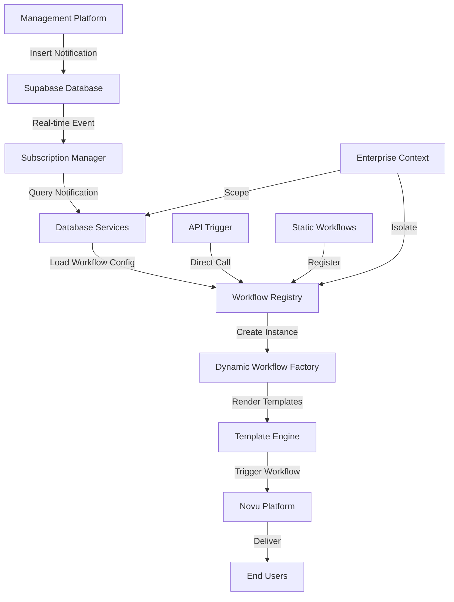

# XNovu Dynamic Workflow System - Architecture Overview

## Introduction

The XNovu Dynamic Workflow System is a comprehensive enterprise notification platform built on top of Novu.co, designed specifically for smart building management platforms. This document provides a detailed architectural overview of the system's design, components, and data flow.

## Table of Contents

- [System Architecture](#system-architecture)
- [Core Components](#core-components)
- [Data Flow](#data-flow)
- [Enterprise Isolation](#enterprise-isolation)
- [Security Architecture](#security-architecture)
- [Performance & Scalability](#performance--scalability)
- [Integration Points](#integration-points)
- [Design Patterns](#design-patterns)

## System Architecture

### High-Level Architecture

```
┌─────────────────────────────────────────────────────────────────────────────┐
│                           Smart Building Management Platform                 │
└─────────────────────────┬───────────────────────────────────────────────────┘
                          │ Database Inserts
                          ▼
┌─────────────────────────────────────────────────────────────────────────────┐
│                            XNovu Notification System                        │
│                                                                             │
│  ┌─────────────────┐    ┌─────────────────┐    ┌─────────────────────────┐  │
│  │   API Layer     │    │  Workflow       │    │   Database Services     │  │
│  │                 │    │  Management     │    │                         │  │
│  │ • /api/trigger  │◄──►│ • Registry      │◄──►│ • NotificationService   │  │
│  │ • /api/novu     │    │ • Factory       │    │ • WorkflowService       │  │
│  │ • Health checks │    │ • Discovery     │    │ • Template Integration  │  │
│  └─────────────────┘    └─────────────────┘    └─────────────────────────┘  │
│           │                       │                          │               │
│           ▼                       ▼                          ▼               │
│  ┌─────────────────┐    ┌─────────────────┐    ┌─────────────────────────┐  │
│  │  Realtime       │    │   Template      │    │     Supabase            │  │
│  │  Subscription   │    │   Rendering     │    │     Database            │  │
│  │  Manager        │    │   Engine        │    │                         │  │
│  └─────────────────┘    └─────────────────┘    └─────────────────────────┘  │
└─────────────────────────────────────────────────────────────────────────────┘
                          │
                          ▼
┌─────────────────────────────────────────────────────────────────────────────┐
│                              Novu Platform                                  │
│                                                                             │
│  ┌─────────────────┐    ┌─────────────────┐    ┌─────────────────────────┐  │
│  │   Workflow      │    │   Channel       │    │    Delivery             │  │
│  │   Engine        │    │   Management    │    │    Infrastructure       │  │
│  │                 │    │                 │    │                         │  │
│  │ • Static        │    │ • EMAIL         │    │ • Provider Management   │  │
│  │ • Dynamic       │    │ • IN_APP        │    │ • Retry Logic           │  │
│  │ • Enterprise    │    │ • SMS           │    │ • Status Tracking       │  │
│  │   Scoped        │    │ • PUSH          │    │ • Delivery Analytics    │  │
│  └─────────────────┘    └─────────────────┘    └─────────────────────────┘  │
└─────────────────────────────────────────────────────────────────────────────┘
                          │
                          ▼
┌─────────────────────────────────────────────────────────────────────────────┐
│                        Notification Channels                                │
│                                                                             │
│  ┌─────────────────┐    ┌─────────────────┐    ┌─────────────────────────┐  │
│  │     Email       │    │    In-App       │    │    SMS & Push           │  │
│  │   Providers     │    │  Notifications  │    │    Providers            │  │
│  │                 │    │                 │    │                         │  │
│  │ • SendGrid      │    │ • WebSocket     │    │ • Twilio                │  │
│  │ • Mailgun       │    │ • Polling       │    │ • Firebase              │  │
│  │ • AWS SES       │    │ • Real-time     │    │ • APNs                  │  │
│  └─────────────────┘    └─────────────────┘    └─────────────────────────┘  │
└─────────────────────────────────────────────────────────────────────────────┘
```

### Component Interaction Flow



## Core Components

### 1. API Layer

**Purpose**: Provides HTTP endpoints for workflow triggering and system integration.

**Components**:
- **Trigger Endpoint** (`/api/trigger`): Unified workflow triggering with enterprise support
- **Novu Bridge** (`/api/novu`): Dynamic workflow serving to Novu platform
- **Health Checks** (`/api/health`): System status and monitoring

**Key Features**:
- Enterprise-aware request handling
- Payload validation and enhancement
- Status tracking integration
- Error handling and logging

### 2. Workflow Management Layer

#### Workflow Registry
**Purpose**: Central repository for all workflow instances with enterprise isolation.

```typescript
interface WorkflowRegistry {
  // Static workflow management
  registerStaticWorkflow(key: string, instance: any): void;
  
  // Dynamic workflow management
  loadEnterpriseWorkflows(enterpriseId: string): Promise<void>;
  registerDynamicWorkflow(key: string, config: WorkflowConfig, enterpriseId: string): void;
  
  // Workflow retrieval
  getWorkflow(key: string, enterpriseId?: string): RegisteredWorkflow | null;
  getEnterpriseWorkflows(enterpriseId: string): RegisteredWorkflow[];
  
  // Management operations
  reloadEnterpriseWorkflows(enterpriseId: string): Promise<void>;
  unregisterWorkflow(key: string, enterpriseId?: string): boolean;
}
```

#### Dynamic Workflow Factory
**Purpose**: Creates Novu workflow instances from database configuration.

**Process Flow**:
1. Validate workflow configuration
2. Create Novu workflow definition
3. Configure channel steps based on templates
4. Integrate status tracking hooks
5. Return executable workflow instance

**Supported Channels**:
- EMAIL: Template-driven with subject/body rendering
- IN_APP: Dashboard notifications with custom data
- SMS: Template-based text notifications
- PUSH: Mobile/browser push notifications

#### Workflow Discovery
**Purpose**: Auto-discovers static workflows from filesystem structure.

**Discovery Rules**:
- Scans `app/novu/workflows/` directory
- Each subdirectory represents a workflow
- Requires `index.ts` export file
- Converts directory names to workflow keys
- Validates workflow structure

### 3. Database Services Layer

#### NotificationService
**Purpose**: Enterprise-scoped CRUD operations for notification records.

**Key Operations**:
- Notification lifecycle management
- Status tracking (PENDING → PROCESSING → SENT/FAILED)
- Enterprise isolation enforcement
- Error tracking and reporting

```typescript
interface NotificationService {
  getNotification(id: number, enterpriseId: string): Promise<NotificationRow | null>;
  createNotification(notification: NotificationInsert): Promise<NotificationRow>;
  updateNotificationStatus(id: number, status: NotificationStatus, enterpriseId: string): Promise<void>;
  getNotificationsByStatus(status: NotificationStatus, enterpriseId: string): Promise<NotificationRow[]>;
  cancelNotification(id: number, enterpriseId: string): Promise<void>;
}
```

#### WorkflowService
**Purpose**: Workflow configuration management and persistence.

**Configuration Structure**:
```typescript
interface WorkflowConfig {
  workflow_key: string;
  workflow_type: 'STATIC' | 'DYNAMIC';
  channels: ChannelType[];
  template_overrides: {
    emailTemplateId?: number;
    inAppTemplateId?: number;
    smsTemplateId?: number;
    pushTemplateId?: number;
  };
  payload_schema?: any;
  enterprise_id: string;
}
```

### 4. Template Rendering Engine

**Purpose**: Processes templates with variable interpolation and enterprise scoping.

**Features**:
- `{{ xnovu_render() }}` syntax support
- Nested template rendering
- Variable interpolation
- Caching with TTL
- Enterprise isolation

**Rendering Process**:
1. Parse template for `xnovu_render` calls
2. Load referenced templates from database
3. Recursively process nested templates
4. Interpolate variables
5. Return rendered content

### 5. Realtime Subscription Manager

**Purpose**: Listens for database changes and triggers workflows automatically.

**Subscription Flow**:
1. Subscribe to `ent_notification` INSERT events
2. Filter by enterprise context
3. Query complete notification data
4. Determine appropriate workflow
5. Trigger workflow execution

### 6. Enterprise Isolation Layer

**Purpose**: Ensures complete data separation between enterprises.

**Implementation**:
- Database queries automatically scoped by `enterprise_id`
- Workflow registry maintains enterprise-specific instances
- Template rendering respects enterprise context
- API endpoints validate enterprise access

## Data Flow

### 1. Static Workflow Execution

```
1. API Request → /api/trigger
2. Validate payload
3. Get workflow from registry
4. Trigger Novu workflow
5. Return response
```

### 2. Dynamic Workflow Execution

```
1. API Request → /api/trigger (with enterpriseId)
2. Load enterprise workflows if needed
3. Validate workflow exists and is published
4. Update notification status to PENDING
5. Create enhanced payload with context
6. Get workflow instance from registry
7. Trigger Novu workflow with template rendering
8. Update notification status to PROCESSING
9. On completion: Update to SENT/FAILED
10. Return response with transaction ID
```

### 3. Realtime Triggered Execution

```
1. Management Platform → Insert notification record
2. Supabase → Real-time event to Subscription Manager
3. Subscription Manager → Query full notification data
4. Database Services → Load workflow configuration
5. Workflow Registry → Get/Create workflow instance
6. Template Engine → Render content with variables
7. Novu Platform → Execute workflow
8. Status Updates → Track through lifecycle
```

### 4. Template Rendering Flow

```
1. Workflow requests template rendering
2. Template Engine loads template by ID
3. Parse for xnovu_render() calls
4. Recursively load and process nested templates
5. Interpolate variables
6. Cache rendered result
7. Return subject/body content
```

## Enterprise Isolation

### Database Level Isolation

**Row Level Security (RLS)**:
```sql
-- All tables have enterprise_id scoping
CREATE POLICY "enterprise_isolation" ON notify.ent_notification
FOR ALL USING (enterprise_id = current_setting('app.current_enterprise_id'));
```

**Query Patterns**:
```typescript
// All queries automatically include enterprise_id filter
const notifications = await supabase
  .from('ent_notification')
  .select('*')
  .eq('enterprise_id', enterpriseId);
```

### Application Level Isolation

**Workflow Registry**:
- Static workflows: Shared across all enterprises
- Dynamic workflows: Enterprise-specific instances
- Workflow keys: Can be reused across enterprises
- Cache keys: Include enterprise context

**Template Engine**:
- Template loading: Scoped by enterprise_id
- Cache keys: Include enterprise context
- Variable context: Enterprise-specific data only

**API Layer**:
- Request validation: Verify enterprise access
- Payload enhancement: Add enterprise context
- Response filtering: Only enterprise data

## Security Architecture

### Authentication & Authorization

**API Security**:
- Environment-based API keys
- Rate limiting per enterprise
- Input validation and sanitization
- CORS configuration

**Database Security**:
- Row Level Security (RLS) policies
- Connection pooling with credentials rotation
- Parameterized queries preventing injection
- Audit logging for compliance

**Template Security**:
- Safe variable interpolation
- Sandboxed template execution
- Input validation on template creation
- XSS prevention in rendered content

### Data Protection

**Encryption**:
- Database encryption at rest (Supabase)
- TLS for all connections
- Environment variable encryption
- Sensitive data masking in logs

**Privacy**:
- Enterprise data isolation
- Minimal data collection
- Configurable data retention
- GDPR compliance support

## Performance & Scalability

### Caching Strategy

**Workflow Registry**:
- In-memory workflow instance cache
- Lazy loading of dynamic workflows
- Cache invalidation on configuration changes

**Template Engine**:
- Template cache with TTL (5 minutes default)
- Compiled template caching
- Periodic cache cleanup

**Database**:
- Connection pooling
- Query result caching
- Index optimization for common queries

### Scalability Patterns

**Horizontal Scaling**:
- Stateless application design
- Load balancer compatible
- Shared cache via Redis
- Database read replicas

**Vertical Scaling**:
- Efficient memory usage
- CPU-optimized processing
- Configurable resource limits

**Database Optimization**:
```sql
-- Key performance indexes
CREATE INDEX CONCURRENTLY idx_notification_enterprise_status 
ON notify.ent_notification(enterprise_id, notification_status);

CREATE INDEX CONCURRENTLY idx_workflow_enterprise_type 
ON notify.ent_notification_workflow(enterprise_id, workflow_type, publish_status);
```

### Performance Monitoring

**Application Metrics**:
- Workflow execution time
- Template rendering performance
- Database query duration
- Cache hit rates

**System Metrics**:
- Memory usage patterns
- CPU utilization
- Database connection health
- API response times

## Integration Points

### Novu Platform Integration

**Bridge Endpoint** (`/api/novu`):
- Serves workflow definitions to Novu
- Handles webhook callbacks
- Manages workflow discovery
- Provides step execution context

**Workflow Definition**:
```typescript
// Dynamic workflows are created with proper step definitions
workflow(workflowKey, async ({ step, payload }) => {
  // Status tracking
  await updateNotificationStatus(payload.notificationId, 'PROCESSING');
  
  // Channel execution with template rendering
  await step.email('dynamic-email', async () => ({
    subject: await renderTemplate(templateId, variables),
    body: await renderTemplate(templateId, variables)
  }));
  
  // Completion tracking
  await updateNotificationStatus(payload.notificationId, 'SENT');
});
```

### Supabase Integration

**Real-time Subscriptions**:
```typescript
const subscription = supabase
  .channel('notifications')
  .on('postgres_changes', {
    event: 'INSERT',
    schema: 'notify',
    table: 'ent_notification'
  }, handleNotificationInsert)
  .subscribe();
```

**Database Operations**:
- Auto-generated TypeScript types
- Enterprise-scoped queries
- Transaction management
- Error handling and retry logic

### Management Platform Integration

**API Contract**:
```typescript
// Trigger endpoint accepts standardized payload
interface TriggerRequest {
  workflowId: string;
  enterpriseId?: string;
  payload: Record<string, any>;
  subscriberId?: string;
  notificationId?: number;
}
```

**Database Integration**:
- Notification table inserts trigger workflows
- Status updates reflect processing state
- Error tracking for debugging
- Audit trail for compliance

## Design Patterns

### Factory Pattern
**Dynamic Workflow Factory**: Creates workflow instances from configuration.

### Registry Pattern
**Workflow Registry**: Central repository with enterprise isolation.

### Template Method Pattern
**Template Rendering**: Consistent rendering process with customizable content.

### Observer Pattern
**Realtime Subscriptions**: React to database changes automatically.

### Strategy Pattern
**Channel Handlers**: Different strategies for each notification channel.

### Singleton Pattern
**Service Instances**: Shared service instances with proper lifecycle management.

### Builder Pattern
**Workflow Configuration**: Flexible workflow definition building.

## Conclusion

The XNovu Dynamic Workflow System architecture provides:

- **Scalable Design**: Horizontal and vertical scaling capabilities
- **Enterprise Isolation**: Complete data separation and security
- **Flexible Workflows**: Both static and dynamic workflow support
- **Template Integration**: Powerful template rendering with nesting
- **Real-time Processing**: Automatic workflow triggering
- **Comprehensive Monitoring**: Full observability and debugging
- **Production Ready**: Security, performance, and reliability features

This architecture supports the complex requirements of smart building management platforms while maintaining simplicity and maintainability for developers.